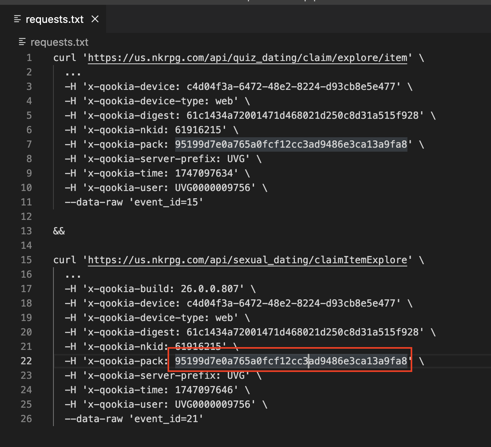

# pqt挂机活动收菜脚本

### 一、使用方式

windows使用claims.ps1和以及requests_ps.txt，mac或linux使用claims.sh和requests.txt。

### 二、浏览器抓包 

该脚本需要配合抓包使用：在浏览器打开游戏后，打开【开发者工具】，转到【网络】选项卡，然后在游戏内领取活动物品，并抓包；

1、鼠标移动至对应网络请求后（如claimItemExplore、item字眼）

1）claimItemExplore

2）item

2、windows

【右键】->【复制】->【以PowerShell格式复制】 ，将复制的内容粘贴至requests_ps.txt文件中。

3、mac或linux

【右键】->【复制】->【以cURL格式复制】 ，将复制的内容粘贴至requests.txt文件中。

### 三、重要事项（必看）

多活动时，需要做一点改动。

1、特别记住【最后一次复制的数据】，并将里面的【x-qookia-pack】右侧双引号中的数据应用到【之前复制的数据】中，并且以【&&】分隔。

1）以最后复制的数据为准，用其覆盖前面已复制的数据

2、重新登录游戏后，复制的数据将会失效，需要重新抓包。

### 四、其他

1、windows可使用自带的计划任务，如每隔1、2个小时执行一次。

2、mac、linux可用crontab等。

> 0 */1 * * * /your/path/to/pqt-claimer/claims.sh >> /your/path/to/pqt-claimer/claimer/info.log 2>&1